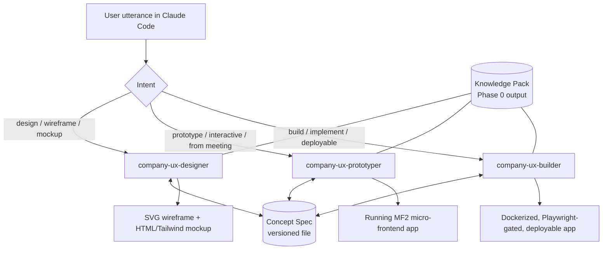

# company-ux-suite — Build Instruction Set

> **Artifact version: 1.0 — LOCKED baseline.** Frozen on approval. Do not edit in
> place; supersede via a v2 artifact with a recorded change rationale.

**Audience:** an agentic coding session (Claude Code).
**Mode:** execute the tasks in order. Treat every schema, path, and acceptance
criterion as a contract. Where a decision is marked `[ASSUMPTION]`, it is a
default the human approved-by-default; surface it if you find a reason it breaks.

---

## 0. How to use this document

This is the spec produced in a prior planning session. It defines a git repo
holding **three coordinated Anthropic Agent Skills** plus a **shared knowledge
kernel** and a **single handoff artifact (the Concept Spec)**. Build the
scaffold and the three skills exactly as specified. The actual ingestion of the
organization's internal UI library (`/internal_ui_stack`) happens in a later
session — this spec defines the *information requirements* and *extraction
methodology* for that ingestion so it is ready to run the moment the folder
arrives.

Work top to bottom. Section 12 is the ordered task list and definition of done.

---

## 1. Decision ledger (create as `DECISIONS.md`)

Record these as the initial baseline. Append future changes with date + rationale.

| # | Decision | Rationale |
|---|----------|-----------|
| D1 | Component meta-model = **open-ui.org** shape (anatomy → parts → states → behaviors → a11y). wandb/openui out of scope. | A formal, framework-agnostic definition of "what a component is." |
| D2 | Internal library is a **modern React** codebase, ingested from `/internal_ui_stack` in a separate **Phase 0** session. | Library content is not yet available; only its information requirements are defined now. |
| D3 | **Three skills**, not one: `company-ux-designer`, `company-ux-prototyper`, `company-ux-builder`, over a shared kernel. | Distinct success criteria, toolchains, and triggering intents. |
| D4 | One **progressively-enriched Concept Spec** is the inter-skill contract; it behaves like a configuration baseline (monotonic enrichment + provenance). | Single source of truth across stateless Claude Code sessions. |
| D5 | Fidelity ladder: **wireframe = SVG**, **mockup = HTML/Tailwind**, **prototype = real running micro-frontend app**, **build = production app**. | Matches requested artifact fidelities. |
| D6 | Prototype topology = **Vite + React + Module Federation 2.0**; the skill **generates the shell** plus remotes. | MF2 is the current default for same-framework (React) micro-frontends; shell is not assumed to pre-exist. |
| D7 | Prototype vs. build boundary: prototypes are fast concept validation with **sample/mocked data, smoke-level checks, throwaway-friendly, rapid iteration**; builds are **production-grade, bound to the real library, Dockerized + pnpm CLI, deployable to local host, Playwright-gated**. | Approved boundary. |
| D8 | Verification = **Playwright** for e2e **and** visual regression (plus axe-core a11y checks, since a11y is in the component model). | Single tool covers both requested checks. |
| D9 | Host = **Claude Code**; skills authored as portable `SKILL.md` Agent Skills with no Claude-Code-only assumptions. | Portability across agentic sessions. |
| D10 | Helper scripts (validators, scaffolders, spec ops) in **Python**; generated UI apps use the **pnpm/Vite/React/TS** toolchain. | Approved language split. |
| D11 | `[ASSUMPTION]` Builder reuses the prototype's MF2 topology when one exists; otherwise it selects single-app vs. micro-frontend by scope and records the choice in `build_directives.architecture`. | He confirmed shell-gen + MF2 for prototypes but did not pin builder topology; this default preserves continuity and is overridable per-concept. |
| D12 | `[ASSUMPTION]` Repo name `company-ux-suite` (houses three skills). Original working name was `company-ux-designer-skill`; renamed to avoid collision with the `company-ux-designer` skill. | Naming clarity; trivially renamable. |
| D13 | `[ASSUMPTION]` Shared resources are authored once under `shared/` and **synced** into each skill bundle by `scripts/sync_shared.py`, so each skill stays self-contained and independently packageable while staying DRY. | Reconciles Agent-Skills self-containment with a shared kernel. |
| D14 | No SDAAD integration now, but a reserved seam is included (Section 11). | Approved; avoid designing out the future state. |

---

## 2. Architecture overview



Three properties hold the system together:

1. **Knowledge Pack (constitution layer).** The internal library modeled in the
   open-ui shape. Every skill reads it; no skill hardcodes component knowledge.
2. **Concept Spec (contract layer).** A single file enriched stage-by-stage. Each
   skill reads it, adds its layer, bumps `fidelity_stage`, and re-validates.
3. **Shared elicitation protocol.** All three skills ask clarifying questions the
   same way and write answers (with provenance) back into the Concept Spec.

---

## 3. Repository structure (scaffold exactly this)

```
company-ux-suite/
├── README.md
├── DECISIONS.md
├── pyproject.toml                       # python helper tooling (ruff, pytest)
├── .gitignore                           # ignore: workspaces/, internal_ui_stack/, node_modules/, dist/, .venv/
├── skills/
│   ├── company-ux-designer/
│   │   ├── SKILL.md
│   │   ├── references/                  # populated by sync_shared.py + skill-specific docs
│   │   ├── scripts/
│   │   └── assets/
│   ├── company-ux-prototyper/
│   │   ├── SKILL.md
│   │   ├── references/
│   │   ├── scripts/
│   │   └── assets/
│   └── company-ux-builder/
│       ├── SKILL.md
│       ├── references/
│       ├── scripts/
│       └── assets/
├── shared/                              # canonical sources (single source of truth)
│   ├── schemas/
│   │   ├── concept-spec.schema.json
│   │   ├── knowledge-pack.schema.json
│   │   └── examples/
│   │       ├── concept-spec.weather-dashboard.json
│   │       └── knowledge-pack.mock-lib.json
│   ├── elicitation/
│   │   └── elicitation-protocol.md
│   ├── docs/
│   │   ├── open-ui-component-model.md
│   │   ├── knowledge-pack-extraction.md   # Phase 0 methodology
│   │   ├── module-federation-2.md
│   │   └── verification-playwright.md
│   └── lib/
│       └── ux_suite/
│           ├── __init__.py
│           ├── spec.py                   # load / validate / merge / version concept spec
│           ├── knowledge.py              # load + query knowledge pack
│           ├── workspace.py              # per-concept workspace creation/layout
│           └── tests/
├── scripts/
│   ├── sync_shared.py                   # propagate shared/ into each skill bundle
│   └── new_concept.py                   # create a new concept workspace + blank spec
├── workspaces/                          # per-concept outputs (gitignored)
│   └── .gitkeep
├── reference-lib/                       # tiny MOCK internal library (de-risking; see §12)
│   └── README.md
└── internal_ui_stack/                   # READ-ONLY mount, provided in Phase 0 (gitignored)
    └── README.md                        # placeholder describing expected contents
```

Per-concept workspace layout (created at runtime under `workspaces/<concept-id>/`):

```
workspaces/<concept-id>/
├── spec/concept-spec.json               # the versioned source of truth
├── spec/history/                        # prior versions (vN snapshots)
├── design/                              # *.svg wireframes, *.html mockups
├── prototype/                           # MF2 app (shell + remotes)
├── build/                               # production MF2/single app + docker
└── logs/elicitation.jsonl               # mirror of the spec's elicitation_log
```

---

## 4. Phase 0 — internal library ingestion (information requirements)

Phase 0 runs later, when `/internal_ui_stack` is mounted. Its job: read the React
codebase and emit a **Knowledge Pack** that validates against
`shared/schemas/knowledge-pack.schema.json`. Define both the schema and the
extraction methodology now.

### 4.1 Knowledge Pack — required information (the "what to extract")

Author `shared/schemas/knowledge-pack.schema.json` (JSON Schema 2020-12) capturing:

- **`meta`** — `library_name`, `library_version`, `source_commit`, `generated_at`,
  `extractor_version`, `coverage_confidence` (0–1).
- **`tech_stack`** — `framework` (+version), `language` (ts/js), `bundler`,
  `package_manager`, `node_version`, `styling_system`
  (`tailwind` | `css-vars` | `css-in-js` | `other`), `peer_dependencies[]`,
  `build_commands{dev,build,test}`, `supported_targets[]`.
- **`design_tokens`** — `source` (file path + format), and resolved token groups:
  `color`, `typography`, `spacing`, `radius`, `shadow`, `zindex`, `breakpoints`,
  `motion`; each with `light` / `dark` values where applicable.
- **`design_principles`** — `principles[]`, `voice_tone`, `density`,
  `layout_grids`, `brand_constraints`, `do[]`, `dont[]`.
- **`components[]`** — per component, in **open-ui shape**:
  - `name` (canonical), `aliases[]`, `category`, `status`
    (`stable`|`beta`|`deprecated`)
  - `import` `{package, export, path}`
  - `anatomy.parts[]`, `slots[]`
  - `props[]` `{name, type, required, default, enum[], description}`
  - `variants[]`
  - `states[]` (e.g. default, hover, focus, active, disabled, loading, error,
    selected, expanded)
  - `behaviors[]` `{trigger, result}` and `keyboard_map[]`
  - `accessibility` `{role, aria[], focus_management, wcag_notes}`
  - `composition` `{composed_of[], commonly_used_with[]}`
  - `tokens_used[]`
  - `examples[]` `{title, code | story_id}`
  - `source_refs[]` (file paths, Storybook IDs, docs URLs) — provenance
- **`patterns[]`** — endorsed higher-order templates (page layouts, form
  patterns, dashboard shells) with the components they compose.
- **`app_shell`** — `routing_lib`, `theme_provider`, `layout_primitives[]`,
  `recommended_structure` (how apps are normally wired).
- **`capabilities`** / **`gaps`** — what the library does and does NOT cover
  (e.g. charts, data grid, maps), so skills know when to compose vs. reach out.
- **`coverage_report[]`** — per component: `extracted`, `confidence`, `missing[]`.

### 4.2 Extraction methodology (author as `shared/docs/knowledge-pack-extraction.md`)

Tell the Phase 0 session where to look in a React repo and how to map findings to
the schema:

- `package.json` / lockfile → `tech_stack`, `peer_dependencies`, `build_commands`.
- `tsconfig.json` → language, path aliases.
- Tailwind config / CSS variables / token JSON → `design_tokens`
  (resolve theme objects; capture light/dark).
- `src/**/components/**` source → component `props` (from TS interfaces /
  PropTypes), `variants`, `states`, `anatomy`.
- `*.stories.*` (Storybook) → `examples`, `variants`, `states`, `source_refs`.
- `*.mdx` / docs site → `design_principles`, usage `do/dont`, `examples`.
- `index.ts` / barrel exports → canonical `name` + `import`.
- Tests / a11y configs → `accessibility`, `behaviors`.
- README / contributing / design-system docs → `principles`, `capabilities`,
  `gaps`, `app_shell`.

Output rules: never invent props or behaviors — if unknown, record in
`coverage_report.missing[]` with low confidence. Provenance (`source_refs`) is
mandatory for every component.

---

## 5. Concept Spec — the handoff contract

Author `shared/schemas/concept-spec.schema.json` (JSON Schema 2020-12). The spec
is enriched monotonically; each stage adds its section and advances
`fidelity_stage` in the order: `draft → wireframe → mockup → interactive_prototype
→ buildable → built`.

### 5.1 Schema (author this; abbreviated structure shown)

```json
{
  "$schema": "https://json-schema.org/draft/2020-12/schema",
  "$id": "https://company.example/schemas/concept-spec.schema.json",
  "title": "UX Concept Spec",
  "type": "object",
  "required": ["schema_version", "id", "version", "fidelity_stage", "intent"],
  "properties": {
    "schema_version": { "type": "string", "const": "1.0" },
    "id": { "type": "string", "description": "concept-id, slug + short hash" },
    "version": { "type": "integer", "minimum": 1 },
    "fidelity_stage": {
      "type": "string",
      "enum": ["draft","wireframe","mockup","interactive_prototype","buildable","built"]
    },
    "knowledge_pack_ref": {
      "type": "object",
      "properties": { "library_name": {"type":"string"}, "library_version": {"type":"string"} }
    },
    "source": {
      "type": "object",
      "description": "Origin of this concept",
      "properties": {
        "request": { "type": "string" },
        "context_artifacts": {
          "type": "array",
          "items": { "type": "object",
            "properties": { "kind": {"type":"string","enum":["meeting_transcript","doc","image","url","other"]},
                            "ref": {"type":"string"} } }
        }
      }
    },
    "intent": {
      "type": "object",
      "required": ["goal"],
      "properties": {
        "goal": { "type": "string" },
        "personas": { "type": "array", "items": { "type": "object",
          "properties": { "name":{"type":"string"}, "needs":{"type":"string"} } } },
        "success_criteria": { "type": "array", "items": { "type": "string" } },
        "constraints": { "type": "object",
          "properties": { "platforms":{"type":"array","items":{"type":"string"}},
                          "devices":{"type":"array","items":{"type":"string"}},
                          "a11y_target":{"type":"string","default":"WCAG 2.2 AA"},
                          "brand":{"type":"string"} } },
        "non_goals": { "type": "array", "items": { "type": "string" } }
      }
    },
    "information_architecture": {
      "type": "object",
      "properties": {
        "screens": { "type": "array", "items": { "type": "object",
          "required": ["id","name"],
          "properties": { "id":{"type":"string"}, "name":{"type":"string"}, "purpose":{"type":"string"} } } },
        "navigation": { "type": "array", "items": { "type": "object",
          "properties": { "from":{"type":"string"}, "to":{"type":"string"}, "trigger":{"type":"string"} } } },
        "flows": { "type": "array", "items": { "type": "object",
          "properties": { "name":{"type":"string"}, "steps":{"type":"array","items":{"type":"string"}} } } }
      }
    },
    "data_model": {
      "type": "object",
      "properties": {
        "entities": { "type": "array", "items": { "type": "object",
          "properties": { "name":{"type":"string"}, "fields":{"type":"array","items":{"type":"string"}} } } },
        "sources": { "type": "array", "items": { "type": "object",
          "properties": { "name":{"type":"string"}, "kind":{"type":"string","enum":["api","mock","static"]},
                          "contract":{"type":"string"} } } },
        "sample_data_ref": { "type": "string" }
      }
    },
    "composition": {
      "type": "array",
      "description": "Per-screen regions and responsive behavior",
      "items": { "type": "object",
        "properties": { "screen_id":{"type":"string"},
          "regions":{"type":"array","items":{"type":"object",
            "properties":{ "name":{"type":"string"}, "responsive":{"type":"string"} }}},
          "breakpoints":{"type":"array","items":{"type":"string"}} } }
    },
    "component_bindings": {
      "type": "array",
      "description": "THE linchpin: each UI need -> a canonical library component",
      "items": { "type": "object",
        "required": ["screen_id","need","component"],
        "properties": {
          "screen_id": { "type": "string" },
          "need": { "type": "string" },
          "component": { "type": "string", "description": "canonical name from Knowledge Pack" },
          "variant": { "type": "string" },
          "state_set": { "type": "array", "items": { "type": "string" } },
          "props": { "type": "object" },
          "gap": { "type": "boolean", "default": false,
                   "description": "true if no library component covers this need" }
        } }
    },
    "theming": {
      "type": "object",
      "properties": { "token_overrides":{"type":"object"}, "mode":{"type":"string","enum":["light","dark","both"]} }
    },
    "interaction_behavior": {
      "type": "array",
      "items": { "type": "object",
        "properties": { "screen_id":{"type":"string"},
          "states":{"type":"array","items":{"type":"string","description":"empty/loading/error/success/..."}},
          "validation":{"type":"array","items":{"type":"string"}},
          "transitions":{"type":"array","items":{"type":"string"}} } }
    },
    "accessibility": {
      "type": "object",
      "properties": { "wcag_target":{"type":"string","default":"WCAG 2.2 AA"},
                      "keyboard_model":{"type":"string"}, "focus_order":{"type":"array","items":{"type":"string"}} }
    },
    "assets": {
      "type": "object",
      "properties": {
        "wireframes":{"type":"array","items":{"type":"string"}},
        "mockups":{"type":"array","items":{"type":"string"}},
        "prototype":{"type":"object","properties":{"path":{"type":"string"},"run_cmd":{"type":"string"}}},
        "build":{"type":"object","properties":{"path":{"type":"string"},"run_cmd":{"type":"string"},"images":{"type":"array","items":{"type":"string"}}}}
      }
    },
    "build_directives": {
      "type": "object",
      "description": "Builder-owned; ignored by designer/prototyper",
      "properties": {
        "architecture": { "type":"string", "enum":["micro_frontend_mf2","single_app"], "default":"micro_frontend_mf2" },
        "framework_target": { "type":"string" },
        "deploy_target": { "type":"string", "default":"local_host_docker_compose" },
        "test_strategy": { "type":"object",
          "properties": { "e2e":{"type":"boolean","default":true},
                          "visual_regression":{"type":"boolean","default":true},
                          "a11y":{"type":"boolean","default":true} } },
        "acceptance_tests": { "type":"array","items":{"type":"string"} }
      }
    },
    "elicitation_log": {
      "type": "array",
      "description": "Provenance ledger; compounds across stages",
      "items": { "type": "object",
        "required": ["question","status"],
        "properties": {
          "stage": { "type":"string" },
          "question": { "type":"string" },
          "answer": { "type":"string" },
          "status": { "type":"string", "enum":["answered","inferred","assumed","open"] },
          "timestamp": { "type":"string","format":"date-time" }
        } }
    },
    "sdaad": { "type": "object", "description": "RESERVED for future SDAAD integration; do not populate now" }
  }
}
```

### 5.2 Lifecycle rules (enforce in `ux_suite/spec.py`)

- **Validate on every read and write.** Refuse to advance a stage if the prior
  stage's required sections are absent (e.g. builder requires
  `component_bindings` populated and no unresolved `gap:true` without a recorded
  decision).
- **Monotonic enrichment.** A later stage may add or refine, never silently drop;
  snapshot the prior version to `spec/history/v<N>.json` before each `version` bump.
- **Provenance is mandatory.** Every elicited fact lands in `elicitation_log`
  with `status`. `assumed` entries must be visible to the user.

Provide `shared/schemas/examples/concept-spec.weather-dashboard.json` as a fully
worked example (a weather dashboard at `fidelity_stage: mockup`).

---

## 6. Shared elicitation protocol (`shared/elicitation/elicitation-protocol.md`)

Specify a single protocol all three skills follow:

- **Ask only what changes the output.** Before asking, check the request, attached
  context (e.g. a meeting transcript), and existing Concept Spec. Infer where
  reasonable and log as `inferred`.
- **Budget.** Ask in one batched round where possible; cap at the few questions
  that materially change the result. Then proceed.
- **Stage-specific question sets:**
  - *designer:* goal, target users, scope (which screens), key data shown,
    branding/mode, platform/devices, a11y target.
  - *prototyper:* primary flows to demonstrate, screen states (empty/loading/
    error), data shape (for mocks), navigation between remotes.
  - *builder:* confirm stack/library version, test scope (e2e/visual/a11y),
    deploy target, explicit acceptance tests, real data sources vs. mocks.
- **Recording.** Write every Q/A into `intent`/relevant section AND
  `elicitation_log`. Mirror to `logs/elicitation.jsonl`.
- **Non-interactive fallback.** If running without a human in the loop, do not
  block — choose sensible defaults, mark them `assumed`, and list them in the
  final summary.

---

## 7. Skill: `company-ux-designer`

**`SKILL.md` frontmatter**

```yaml
---
name: company-ux-designer
description: >-
  Produce visual designs — SVG wireframes and HTML/Tailwind mockups — for an
  application or screen using the organization's internal UX component library.
  Use this skill whenever the user asks to design, wireframe, mock up, sketch,
  lay out, or explore what a UI/screen/dashboard/app "should look like," even if
  they don't say the word "design." Reads the internal library Knowledge Pack and
  writes a Concept Spec for downstream prototyping and building.
---
```

**Body (specify):**

- **Preconditions:** a Knowledge Pack is loadable (real or the mock in
  `reference-lib/`). If absent, say so and stop.
- **Procedure:** (1) load Knowledge Pack; (2) run elicitation; (3) define
  `intent`, `information_architecture`, `composition`; (4) fill
  `component_bindings` mapping each region to a canonical component (flag `gap`
  where the library lacks coverage); (5) set `theming`; (6) emit one or more
  **SVG wireframes** (low-fidelity, grayscale, structural) to `design/`; (7) emit
  **HTML/Tailwind mockups** that honor the library's tokens and the bound
  components' visual language; (8) write/advance the Concept Spec to
  `mockup` (or `wireframe` if mockups are skipped).
- **Tools/refs:** consult the environment's frontend-design guidance for visual
  quality; `references/wireframe-conventions.md`; `references/open-ui-component-model.md`.
- **Acceptance:** spec validates; every composition region has a binding or a
  recorded gap; mockup uses library tokens (no ad-hoc colors); a11y target set.

---

## 8. Skill: `company-ux-prototyper`

**`SKILL.md` frontmatter**

```yaml
---
name: company-ux-prototyper
description: >-
  Generate a real, running, interactive prototype as a Vite + React + Module
  Federation 2.0 micro-frontend app (the skill generates the shell host plus
  remotes), using the internal UX library with sample/mocked data. Use whenever
  the user asks to prototype, make interactive/clickable, "show a working
  version," or "turn the concept from this meeting into something I can click
  through." Prototypes are fast, throwaway-friendly, and built for rapid, frequent
  iteration. Reads or bootstraps a Concept Spec; reads the Knowledge Pack.
---
```

**Body (specify):**

- **Inputs:** an existing Concept Spec, OR raw context (e.g. a meeting transcript)
  — in the latter case, first run elicitation to bootstrap/enrich the spec to at
  least `mockup`-equivalent detail, then prototype.
- **Topology (MF2):** generate a **shell host** app + one **remote** per major
  view/domain. Use `@module-federation/vite` (with `@module-federation/enhanced`
  runtime). Declare `react`, `react-dom`, and the internal library as **shared
  singletons**. Wire a mock data layer from `data_model.sources` (kind `mock`).
- **Run:** `pnpm install && pnpm dev` brings up shell + remotes locally; provide
  an optional `docker-compose.yml` but keep dev-loop primarily on pnpm for speed.
- **Iteration:** document the fast edit→reload loop; treat output as disposable
  (regenerate freely). Smoke checks only (app boots, routes resolve, remotes
  mount).
- **Refs:** `references/module-federation-2.md`, `references/shell-generation.md`.
- **Acceptance:** app boots via pnpm; shell composes ≥1 remote; spec flows are
  navigable; smoke test passes; spec advanced to `interactive_prototype` with
  `assets.prototype.path` + `run_cmd`.

---

## 9. Skill: `company-ux-builder`

**`SKILL.md` frontmatter**

```yaml
---
name: company-ux-builder
description: >-
  Build production-grade, testable, verifiable, deployable application code from a
  Concept Spec, bound to the real internal UX library. Output ships as Docker
  containers (also runnable via pnpm CLI) for local-host deployment, gated by
  Playwright end-to-end and visual-regression tests plus a11y checks. Use whenever
  the user asks to build, implement, productionize, make deployable, or "make it
  real / ship it." Reads the Knowledge Pack and the Concept Spec.
---
```

**Body (specify):**

- **Preconditions:** Concept Spec present. If it lacks `build_directives`, run
  elicitation to fill them (architecture, deploy target, test scope, acceptance
  tests). Require `component_bindings` complete with no unresolved gaps.
- **Architecture:** default to the prototype's MF2 topology when present
  (`build_directives.architecture: micro_frontend_mf2`); otherwise choose
  `single_app` vs MF2 by scope and record it. `[ASSUMPTION D11]`
- **Implementation:** real internal-library components and tokens; real or
  contract-defined data sources (not mocks unless specified); routing/theming per
  Knowledge Pack `app_shell`.
- **Packaging:** Dockerfile per remote + shell; `docker-compose.yml` for local
  host; pnpm scripts `{dev, build, preview, test, test:visual, test:e2e}`. Public
  registries permitted.
- **Verification (Playwright):** e2e for each spec flow; visual-regression
  snapshots per screen × key state; axe-core a11y pass at the spec's WCAG target.
- **Refs:** `references/docker-pnpm-targets.md`, `references/verification-playwright.md`,
  environment frontend-design guidance.
- **Acceptance gates:** all e2e green; visual baselines established/approved;
  `docker compose up` serves the app on local host; `pnpm preview` also serves it;
  a11y checks pass; spec advanced to `built` with `assets.build` populated
  (paths, run_cmd, image tags).

---

## 10. Cross-cutting conventions

- **Python tooling:** `pyproject.toml` with `ruff` + `pytest`; helper logic lives
  in `shared/lib/ux_suite/`; skill `scripts/` import from it (synced copy).
  Target Python 3.11+.
- **UI toolchain (generated apps):** pnpm, Vite, React + TypeScript, Tailwind,
  Module Federation 2.0 (`@module-federation/vite`, `@module-federation/enhanced`),
  Playwright (+ `@axe-core/playwright`).
- **Self-containment:** `scripts/sync_shared.py` copies `shared/schemas`,
  `shared/elicitation`, relevant `shared/docs`, and the `ux_suite` lib into each
  skill's `references/`, `scripts/`, `assets/`. Run it after any change to
  `shared/`. This keeps each skill independently packageable. `[D13]`
- **Frontend quality:** designer/prototyper/builder must consult the environment's
  frontend-design skill/guidance so mockups, prototypes, and builds are visually
  intentional rather than templated.

---

## 11. SDAAD extension seam (reserve; do not build)

Leave a clean, non-conflicting seam so a future phase can integrate Eric's
spec-driven AI-assisted development workflow without rework:

- Concept Spec carries a reserved top-level `sdaad` object (already in schema).
- Add `shared/docs/sdaad-integration.md` (stub) noting the intended mapping:
  **constitution layer** = Knowledge Pack + design principles;
  **contract layer** = Concept Spec; the SDAAD document-generator prompts could
  emit/consume Concept Specs; the SDAAD wiki bundle could host the Knowledge Pack.
- Keep schemas versioned and stable; avoid naming collisions with SDAAD artifacts.

---

## 12. Build sequencing and definition of done

Execute in order. Use a TODO list.

1. Scaffold the repo tree (§3), `.gitignore`, `pyproject.toml`, `README.md`,
   `DECISIONS.md` (§1).
2. Author `shared/schemas/concept-spec.schema.json` (§5) and
   `shared/schemas/knowledge-pack.schema.json` (§4.1) + both example files.
3. Author `shared/elicitation/elicitation-protocol.md` (§6) and the four
   `shared/docs/*.md` (open-ui model, extraction methodology, MF2, Playwright).
4. Implement `shared/lib/ux_suite/` (`spec.py`, `knowledge.py`, `workspace.py`)
   with the lifecycle rules (§5.2); add `pytest` tests; ensure schema validation
   works against both example files.
5. Implement `scripts/new_concept.py` and `scripts/sync_shared.py`.
6. Author the three `SKILL.md` files and skill-specific `references/`, `scripts/`,
   `assets/` (§§7–9). Run `sync_shared.py`.
7. Build a tiny **mock internal library** under `reference-lib/` plus its matching
   `knowledge-pack.mock-lib.json` (a handful of components: Button, Card, Input,
   Stat, Chart-placeholder, AppShell). Purpose: exercise the full pipeline before
   `/internal_ui_stack` exists.
8. **End-to-end smoke against the mock library:** run designer on
   "design a weather dashboard" → prototyper on the resulting spec → confirm an
   MF2 shell+remote boots via `pnpm dev` → run builder → confirm `docker compose
   up` serves it and Playwright e2e/visual/a11y scaffolding runs.
9. (Optional, later) wrap the three skills in the skill-creator eval harness to
   tune `description` triggering.

**Definition of done (scaffold phase, before `/internal_ui_stack` arrives):**
schemas validate; example specs validate; `ux_suite` tests pass; all three skills
present and made self-contained by `sync_shared.py`; the mock-library pipeline
produces a running MF2 prototype and a Dockerized build with green Playwright
scaffolding. When `/internal_ui_stack` is mounted, only Phase 0 (§4) needs to run
to swap the mock Knowledge Pack for the real one — no skill code should change.
